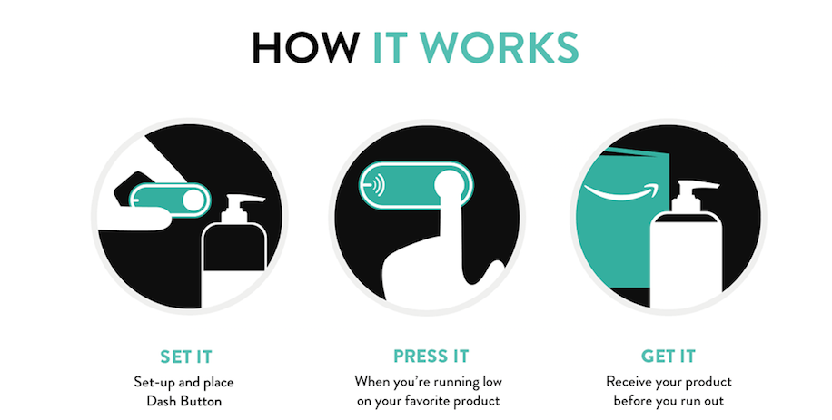
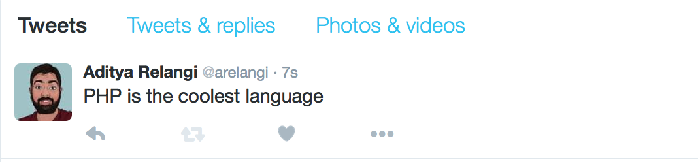

name: inverse
layout: true
class: center, middle, inverse
---
# Getting Fit With .red[Go]
.footnote[talk by [@arelangi](https://twitter.com/arelangi) ]
---
layout: false
.left-column[
  ## Background
  ### - Behavioral Psychology
]
.right-column[

"One of the challenges of human life is what’s good for us in the long term often doesn’t seem good for us right now" - .red[Dan Ariely]


### Fuzzy rules
  If rule breaking has consequences it's has harder to break them

### Pre-commitment devices
  

- Inspired from [Ted Benson's post](https://medium.com/@edwardbenson/how-i-hacked-amazon-s-5-wifi-button-to-track-baby-data-794214b0bdd8#.d7gyvtj5x) tracking infant BM

- Also from [Geoffrey Tisserand](https://medium.com/swlh/getting-a-uber-ride-using-the-amazon-dash-button-c4dcef42051c#.ax407bv9q) to request Uber rides
]

???
- For me, that is working out consistently. Even though I know I should work out it's harder for me to choose to wake up and work out rather than sleeping in. 
- But luckily by understanding where we fall short, we can setup methods to overcome this.
- Consequences in the short term
- Penalty payment for missing workouts
- In our case mention the payment idea and the alternative
---
.left-column[
## Background
  ### - Behavioral Psychology
  ### - Amazon Dash Button
]
.right-column[
 

- Launched on Mar 31, 2015, there's 107 of these buttons last time I checked

- A .red[long] battery life, at least two years<sup>[*](http://www.bitsofcents.com/post/118749233621/disassembling-the-dash)</sup>

- There are two steps to configuring the button
  1. Connect to the wifi
  2. Select the product you want delivered

- All I need to do is hijack the message the button sends to Amazon

]
???

- Introduce the Amazon Dash button

- A half hour window to cancel, notification on phone and immediate feedback from the status light

- 5$ for a button and free after the first purchase

---
.left-column[
  ## Background
  ### - Behavioral Psychology
  ### - Amazon Dash Button
  ### - Idea
]
.right-column[


- Initially wanted to be able to donate to a charity that I do not agree with

- You'd think it's easier to give away your money, but I could find none that have RESTful APIs

- .red[For now] settled on just embarassing myself

 

 

]


???

- Talk about donating to a charity you are against
- Failure to find any RESTful APIs
- Embarassing tweets for programmers with a choice

---

.left-column[
  ## Implementation
  ###  - Networking
]
.right-column[

> ### Address Resolution Protocol.red[(ARP)]

- Maps the IP addresses to the MAC addresses so devices in the same network can communicate directly

- The computer needs to be aware of it's own IP address before it can start using the IP protocol.

- But since IP addresses are not always static it needs to determine the IP using DHCP (Dynamic Host Configuration Protocol)

- A DHCP server (usually resides in the router) is responsible for hading out the IP addresses to the devices

- Connecting computer sends an `ARP probe`  claiming the IP address

]

???
  - Is a protocol above ethernet like IP
- The ARP tables are created to cache the info and refreshed periodically

- Whenever data has to be sent, if the desitnation IP is in the same network the MAC address is retrieved and data is sent

- Routing is done at the IP level not the ARP level. IP packets are sent to the Router's MAC address with the destination IP address

- So, when a device needs to join the network, it sends out a `DHCP Discover` packet. The DHCP server replies by sending out a `DHCP OFFER` packet.

- The device then sends a `DHCP REQUEST` to the DHCP server to get an IP address.

- The server responds with a `DHCP ACK` packet that holds the information about the IP address 


- If the IP address is being used by a device that was set statically, the DHCP server would not be aware, then the device defends itself by using `already in use` packet
- If there is a conflict, the device goes through the same process

---
.left-column[
  ## Implementation
  ### - Networking
  ### - libpcap
]
.right-column[

- We need to watch the packets going on the network for our purposes, which is classic packet capture

- Unix systems implement pcap using the libpcap library

- This was written by the same people that wrote tcpdump and apart from being used for tcpdump it is the tech behind [wireshark](https://www.wireshark.org/)

- We cannot use tcpdump/wireshark for our use case since we don't just want to dump the packet contents or simply view them

- Luckily for us, libpcap is written in C and even more luckily there's a Go wrapper [gopacket](https://github.com/google/gopacket) (this being a Go meetup and all)

]


???

- The dash in order to conserve energy has to send out an ARP probe every time it connects to the network and that's when we capture the info
 
---
.left-column[
 ## Implementation
  ### - Networking
  ### - libpcap
  ### - Find device
]
.right-column[

> Before using gopacket, we need to have libpcap installed

````
sudo apt-get install libpcap-dev
````

Now, the fun stuff

```go
package main

import (
  "fmt"
  "github.com/google/gopacket/pcap"
  "log"
)

func main() {
  // Find all devices
  devices, err := pcap.FindAllDevs()
  if err != nil {
    log.Fatal(err)
  }

  // Print device information
  for _, device := range devices {
    for _, address := range device.Addresses {
      fmt.Println("- IP address: ", address.IP)
      fmt.Println("- Subnet mask: ", address.Netmask)
    }
  }
}
```

]

???

- We can't just `go run` this program, because  in order to access the network card we need to have sudo permission

- So, build and run as sudo

---
.left-column[
  ## Implementation
  ### - Networking
  ### - libpcap
  ### - Find device
  ### - Access the packets
]
.right-column[


> For the interface which in our case is eth0 interface, open a pcap handler to read packets

```go
handle, err := pcap.OpenLive("eth0", 65536, true,
pcap.BlockForever)
if err != nil {
  return err
}
defer handle.Close()
```

Now that we have the handle, we can start reading the packets
```go
//Create a new PacketDataSource
src := gopacket.NewPacketSource(handle, layers.LayerTypeEthernet)
//Packets returns a channel of packets
in := src.Packets()

```

Which means we can iterate on these

]
???


---
.left-column[
## Implementation
  ### - Networking
  ### - libpcap
  ### - Find device
  ### - Access the packets
  ### - Success!
]
.right-column[

> Iterate over the packets


```go
for {
  var packet gopacket.Packet
  select {

    case <-stop:
     return

    case packet = <-in:
      
      arpLayer := packet.Layer(layers.LayerTypeARP)
      if arpLayer == nil {
        continue
      }
      arp := arpLayer.(*layers.ARP)
      if net.HardwareAddr(arp.SourceHwAddress).String() == <AMZN Dash Mac Address> {
          //Do something or don't
      }

    }
  }
```

]

???

- This is where I notify the daemon that the click occured. If the deamon doesn't receive this msg by 10am, it tweets out a msg

---
.left-column[
  ## Deployment
  ### - Raspberry
]
.right-column[

I need this program to run all the time, which makes it a good candidate to run on a Raspberry

#### Concerns

- It'd have been ideal to cross compile, but because of the underlying C bindings, we can't.

- If the case was cross compiling standard libs, we could've used somthing like [gonative](https://github.com/inconshreveable/gonative)

#### Well, what now?

1. Get the Go source code and build it on the Pi (takes two hours)

2. Or use Go1.6 which has official ARMv61 binary releases


]
---
.left-column[
> ### Cost
]
.right-column[

- [Amazon Dash Button](http://www.amazon.com/b?ie=UTF8&node=10667898011) - 5$

- [Raspberry Pi](https://www.raspberrypi.org/blog/raspberry-pi-2-on-sale/) - 35$

- [Wi-fi USB adapter](http://www.amazon.com/Edimax-EW-7811Un-150Mbps-Raspberry-Supports/dp/B003MTTJOY/ref=sr_1_1?ie=UTF8&qid=1459860362&sr=8-1&keywords=raspberry+pi+wifi+dongle) - 9.99$

- Debugging - .red[Priceless]
]
---
name: inverse
layout: true
class: center, middle, inverse
---
# Thank.red[You]
