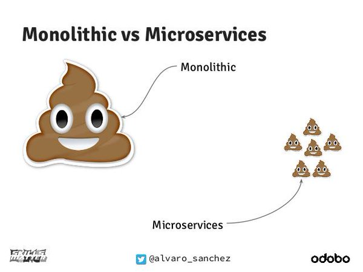

name: inverse
layout: true
class: center, middle, inverse
---

# Building a Self-hosted .red[Serverless] System
.footnote[talk by [@arelangi](http://adityarelangi.com)]

---
layout: false
class: center, middle, inverse
# How did .red[Serverless] come about?

???
## In this talk I'm going to cover three topics
1. What is Serverless, how did we end up here?
2. A high-level overview of what is needed to build a serverless systems
3. An in-depth look at an implementation along with some demos in between

Let's get started

---

class: class: center, middle,inverse
### Monolith


???
- Initially, that is pre-2000 and during 1990s we had the monolithic architecture
- monolithic approach where every component is embodied in a single and often cumbersome application framework
- All the functionality was bundled into a single application
- Everyone worked on the same application
- It wasn't modular, the system was tightly coupled
- Re-usability meant duplicating and copy/paste
- Maintenance, upgrades and delpoyments were hell
- These are applications that were bound to evolve from the waterfall model
- Although, modularity was always something we achieved for, we did not really get to achieve it until web architectures came into the picture
- We realized monoliths aren't going to work and came up with a solution


class: class: center, middle,inverse


---

class: class: center, middle,inverse
### SOA


“…And so these men of Indostan

Disputed loud and long,

Each in his own opinion

Exceeding stiff and strong,

Though each was .red[partly in the right,]

And all were in the wrong!”

-- John Godfrey Saxe

???
- And with that we entered the dotcom era 
- We came up with a new solution to our monolith problem
- SOA/Service Oriented Architecture
- The theme of that era was 'Modularity', 'Modularity and Java'
- Instead of duplicating code we started building libraries
- We broke down the monolith into components it comprises of
- And build whatever the hell this is
- Even though SOA was a step in the right direction, we didn't go far enough

- What we ended up with is building something like this
- A monolith, that wasn't really a monolith, but a monster
- Then came the time for my generation, the millenial generation to step up and define 2010s

---

class: class: center, middle,inverse


???

- And step up we did... oops sorry.. next slide... next slide

---

class: class: center, middle,inverse
### Microservices


???
- Okay, we came up with microservices
- Microservices begin where SOA stopped short
- Instead of modularizing but still being tied to monoliths, we broke everything into
small atomic pieces
- We have a huge common database for everything? Well, instead maintain a separate database for each microservice
- One microservice goes down, no big deal, the rest of your system is operational while you work on the fix
- You want to swap out something new by something newer, go for it cowboy

- a software architecture design pattern, in which complex applications are composed of small, independent processes communicating with each other using language-agnostic APIs. These services are small, highly decoupled and focus on doing a small task.

- And this culture lead to the industry embracing agile which meant changing requirements, smaller developments times, faster deploys and everyone was completely satisfied and lived happily ever after

---

class: center, middle, inverse
### Death Star Architecture Diagrams


???
- Ofcourse, there are issues.
- There is such a thing as too much of a good thing
- We now need to manage all the microservices that we built
- We are now writing new software to manage the software we already wrote
- New ideas and architectures come with their own set of problems

---

class: center, middle, inverse


???
- If you ask me, I think this image corectly represents the state we are in
- This doesn't mean everything is bad and we've made no progress
- Like new ideas and architectures come with their own set of problems, they also open us up for new opportunities.

---

class: center,middle,inverse,big

The best code is .red[no code] at all .small[<br/>- Coding Horror]

<hr/>

The best infrastructure is .red[no infrastructure] at all

???

- It took time for people to realize that what applies to code can also apply to infrastructure
- What's one way to solve this problem?


class: center,middle,inverse, big

Nobody enjoys .red[maintaining Infrastructure]
<hr/>
Not all microservices needs to be running .red[all the time]


- We realized with the move to microservices that it is not necessary to have all our microservices running all the time. 
- If we don't need the microservices running all the time, we don't need the infrastructure to run them all the time.
- aaaand, and why pay for resources when we don't even use them
- There is a cost to running a server, be it paying for the power, bandwidth it uses or for the personnel needed to maintain it.
- These factors along with the industry's acceptance of large cloud service providers, and the advances in technology meant we could go <next slide>
Serverless

---

class: center,middle,inverse

_.bigred[Serverless]_

.big[aka: No permanent infrastructure]

???
- What does it mean?

---

class: center,middle,inverse,defn


Applications that run in .red[stateless] compute containers that are .red[event-triggered], .red[ephemeral], and fully managed by a .red[third party]

???

- One definition of serverless, the one that I think correctly captures what serverless means is this.


Example applications

- File processing. For ex., Seattle Times image
- Processing sensor data
- ETL - order placed, invokes the storage engine and analytics engine which updates the report
- Amazon Alexa 
- Devops


- Let's dig into what each term means


### stateless
- treat each request as an independent transaction that is unrelated to any previous request so that the communication consists of independent pairs of request and response. 


### event-triggered
- the system executes one or more sets of tasks on a certain invocation
- for ex., events such as user actions (mouse clicks, key presses), sensor outputs, or messages from other programs/threads

### ephemereal
- The system is alive only for the duration it takes your application to run

### third party
- Scholars say, defining third party is hard, but I'm gonna take a crack at it.
- Third party stands for anybody that isn't us
- From a serverless perspective this is any cloud service provider
- TBH from a market share perspective it's Amazon
- Now  that we know what serverless is, let's look at what offerings are available from third parties

---

class: center,middle,inverse,defn

AWS .red[Lambda]

Azure .red[Functions]

IBM .red[Openwhisk]

Google .red[Cloud Functions]


???

- TALK ABOUT THE PROS AND CONS

PROS
- No more servers to maintain
- Pay only for what you use 
- DDOs is a billing issue
- Security is not your responsibility

CONS
- Vendor tie-in
- Minimal language support


- The first offering was launched in 2014, Lambda supports Python, Node, C#, Java
- Azure supports C#, F#, Node.js, Python, PHP, batch, bash, or any executable
- Google Node.js, still in Beta
- Openwhisk supports Node.js, Swift and executables too

---

class: center,middle,inverse
layoud: true

# Why would you .red[build] a Serverless system?

???

I've just now mentioned all the major players in the Serverless space and their offerings, why are we embarking on building our own Serverless system?

1. There is a certain amount of vendor tie-in when using any of these products. It isn't easy to use S3 with the Google Cloud Functions and write to your own DB. There's a certain level of tie-in with all these products.
2. I will quote Richard Feynman on this "What I cannot create, I do not understand"

With that, let's see How would we go about it?

---

class: center,middle,inverse
layoud: true

# How would you .red[build] a Serverless system?

???

Now imagine we are the third party, a hot new startup in the infrastructure space that wants to provide Serverless on our platform.

How would we go about it?

---

class: center,middle,inverse

.heading[What makes a serverless system?]


 .medium[Be able to .red[invoke] applications]
 
 .medium[Small .red[boot] time]
 
 .medium[.deepskyblue[Isolation]]
 
 .medium[Scale .red[fast]]
 
 .medium[Capture the compute .red[time]]

.medium[.red[Stateful]] 

???
 - There should be some way that we are able to call an application
 - The time it takes for the application to come up should be as low as possible. We are not concerned about how long it takes for the application to execute, boot time is all we are worried about.
 - The applications must be completely isolated to provide security for the platform it's running on and to avoid any conflicts with other applications.
 - In times of heavy load, we should have the ability to scale quickly
 - Some way to measure the resources consumed by the applications, so that we can charge our users.
 
 
---

class: center,middle,inverse

# Container
  
  .medium[Small .red[boot] time]
 
 .medium[.deepskyblue[Isolation]]
 
 .medium[Scale .red[fast]]
 

???

- Containers as a technology came into prominence with the arrival of Docker in 2013 and weren't seriously put into production until end of 2015.
- Were there no containers before Docker? Ask Behdad and he will tell you about how LXC is far better than Docker
- But what Docker did was make containers accessible to everyone and that is the reason why it is the most popular container technology at the moment.
- So, we are going to built our service using Docker which allows us off the bat to support any application that can be dockerized.
- I'm gonna refer to these dockerized applications as functions from this point as that's the standard terminology

---

class: center,middle,inverse

# Web Server
  
  .medium[.red[Invoke] functions]
  
  .medium[Capture compute .red[time]]

  .medium[.red[Stateful]] 

???

- Most important part of Serverless is the ability to invoke functions on demand. 
- For our end users to be able to run their applications they need a way to interact with our system. 
- To accomplish this, once a user creates a function on our service, we will provide them with a unique URL which when called will invoke the associated function. 
- And the most important thing for a startup is the name and it's brand. I'm gonna name this Granda, (It's like lambda only grander).

---


class: center,middle,inverse

## .container[Docker]

.red[+]

## .goserver[Go Web Server]

.red[=]

.impact[.red[_Granda_]]

???
- And the second most important thing for a startup is the landing page. Let's visit our site.
- Transition to the site and talk about the architecture and the features
- Any event that originates from Mobile, Desktop, an IOT device or some other application can trigger a function by making a call to the API
- The API gateway routes your request to the associated function. This function is a docker app that contains an executable. We are not concerned with what is inside the application
- We are interested in it's invocation only
- This function after it finishes it's application can drive its output to whereever it wants

---

class: center,middle,inverse

# Demo Time


???

- go-tweet-go

---

class: inverse

### Server

- Our program has to run a server and at the same time communicate with the Docker daemon.
- In order for Granda to maintain state we are also going to rely on an SQLite database. 

```go
import "github.com/docker/docker/client"

type Image struct {
	funcName    string // User defined function name
	Description string 
	imageName   string // Docker image
	Timeout     int    // Timeout
}

func main() {
    cli, _ = client.NewEnvClient() //Docker client
    router = mux.NewRouter() //Server
    
    router.HandleFunc("/createFunc", CreateFunctionHandler)//Creates a new function
    
    http.ListenAndServe(":8881", router)
}
```


???


- Let us look at the backend now.
- This struct maps one to one to what you saw in the user input form
- CreateFunc is the API end point for creating the new function
 


---
class: inverse

### CreateFunction

```go

func CreateFunctionHandler(w http.ResponseWriter, r *http.Request){
    //read user input
    imageName := r.PostFormValue("image")
    img := Image{funcName: funcName, Description: description, 
            imageName: imageName, Timeout: timeout}
    resp := CreateFunction(img)
}

func CreateFunction(img Image) (response FunctionCreatedResponse) {
    //Generate unique URL endpoint
	routerPath := getNewPath(funcName)
	router.HandleFunc(routerPath, ContainerRunHandler)

	//Pull image and send a response
	if !checkIfImageExists(tagName) {
		if err := cli.ImagePull(ctx, imageName, types.ImagePullOptions{});err==nil{
            reponse = true
        }    
	}
	
	// Update the DB and return
    pathToImage[routerPath] = img
	StoreFunctionToDB(img.funcName, img.imageName, routerPath, img.Timeout)
    return
}


```


???
- There's primarily four parts to this.
- Reading sser input
- Generating URL
- Pulling image
- Updating the state

- That's how the function is created. Now let's see what happens when the URL is invoked


env GOOS=linux go build main.go


class:  inverse

### Create a Granda Function

````

> env GOOS=linux go build main.go
> docker build -t zexyphantom/go-sms .
> docker push zexyphantom/go-sms

````

- This docker image is currently pushed to a docker repository which Granda should be able to pull

- Let's go create a new Granda Function

???

- Now that my image is in a repository from where Granda can pull it, I'm gonna go and create the function

- Values to fill

send-sms
Send sms when a user submits the form
zexyphantom/go-sms
15


- Name and email
Vladimir Putin
vladsofab@mailinator.com

---

class: inverse

### What happened when our function was called?

```go
	router.HandleFunc(routerPath, ContainerRunHandler)
```

 ContainerRunHandler got called, which in turn calls _RunContainer_


```go

func ContainerRunHandler(w http.ResponseWriter, r *http.Request) {
    //Extracts info
    path := r.RequestURI
	
    //Invokes the container
    response := RunContainer(path, pathToImage[path], runResponse)

	//Respond back
	w.Write(response)
}
```

???
- If you remember, we had a line in our code to add a new handler when our path is called. That handler got executed on our call.
- Let's see what happens in the ContainerRunHandler

---

class: inverse

### RunContainer

```go
func RunContainer(urlPath string, img Image, runResponse chan string) {
	//Track time
	begin := time.Now()
    
	//Create and Start container
	resp, _ := cli.ContainerCreate(ctx, &container.Config{
		      Image: img.imageName
		      },..)
	cli.ContainerStart(ctx, resp.ID, types.ContainerStartOptions{})

	//Wait for the container to execute
	timeoutContext := getTimeoutContext(img.Timeout*time.Second)
	if _, err := cli.ContainerWait(timeoutContext, resp.ID); err != nil {
			//force kill
			cli.ContainerRemove(ctx, resp.ID, types.ContainerRemoveOptions{
            Force: true})		
			status = "Operation Timed Out"
	} else {
       status = "Success"
	}

	//Cleanup and return
	cli.ContainerRemove(ctx, resp.ID, types.ContainerRemoveOptions{})
	StoreComputeTimeToDB(time.Since(begin), status )
	runResponse <- status
}
```

???
- Run Container has 4 primary parts
- Track time
- Create and Start container
- Wait for the container to execute
- Cleanup and return
- If you noticed one thing, our program just runs a certain function. What use is it really if we can't pass any data to our function. Can we do something about it?

---


class: inverse, middle,center

## Exploiting the docker .red[CMD ]

???
If you want to run your <command> without a shell then you must express the command as a JSON array and give the full path to the executable. This array form is the preferred format of CMD. Any additional parameters must be individually expressed as strings in the array

---


class: inverse

### A Better RunContainer

```go
//ContainerRunHandler change
body, _ := ioutil.ReadAll(r.Body)
RunContainer(string(body), path, pathToImage[path], runResponse)

```
### Notice we added a new .red[Cmd] member to _ContainerCreate_

```go
func RunContainer(userMessage string, urlPath string, img Image, runResponse chan string) {
	begin := time.Now()
    done := make(chan bool)
	
	resp, _ := cli.ContainerCreate(ctx, &container.Config{
		      Image: img.imageName,
              Cmd:   userMessage,
              }...)
	
}
```


???

- Now that you've noticed it, you might ask what the big deal is
- To know this you need to understand how CMD and ENTRYPOINT work in Docker
- Let's take a look at the docker file
- This particular example echoes out whatever argument we give it
- When you make your container runnable by adding either ENTRYPOINT or CMD, you can override the CMD arguments
- As you've seen from the example, we are exploiting the CMD to pass on a message into the container
- It is upto the application inside the container to do what it wants to do with it
 
- Now you might be wondering, this is all well and good, but nobody said I have to dockerize my code to be Serverless. I just want to write the code and not worry about any of the Ops stuff at all
- Yes, I agree, but listen if you are not ready to do some Ops at least, we can't provide all this amazing stuff
- You say you aren't interested any more? 
- Ok alright, then let me show you the Enterprise version of Granda

---

class: center,middle,inverse

# .red[Granda <sup>EE]


???
- Does this mean there are no more servers?

---

class: inverse

### A Better CreateFunction

```go
import "github.com/docker/docker/api/types"

func CreateFunction(w http.ResponseWriter, r *http.Request) {
	//get user input
	runTime := r.PostFormValue("runtime")
	code := r.PostFormValue("code")
	imageName := strings.ToLower(r.PostFormValue("imagename"))

	//Create the Tar file
	dFile := CreateDockerFile(runTime, code)
	cFile := CreateCodeFile(code)
	tarPath := CreateTarFile(dFile, cFile)

	//Create New Docker Image
	buildOptions := types.ImageBuildOptions{
		Tags: []string{imageName},
	}
	cli.ImageBuild(context.Background(), dockerBuildContext, buildOptions)

	//Call CreateFunction and send a response back
	img := Image{funcName: funcName, imageName: imageName, Timeout: timeout,
			 Description: description}
	response := CreateFunction(img)
	return
}
```
???

- Let's create this new function, and improve our website to send out welcome emails whenever a user shows registers

email-go
Sends out an email
zexyphantom/mail-go
15

vladsofab@mailinator.com


---


class: center, middle,inverse

.bigred[.dis[Serverless]]

<!---->


???
- No, they are present, only you don't see them
- I hope this gave you an idea about what Serverless is, what sort of applications are good for serverless and how one might go about building their own Serverless system
---

class: center, middle,inverse


